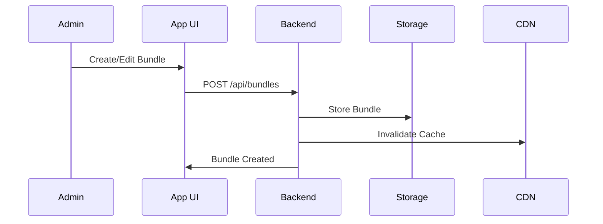
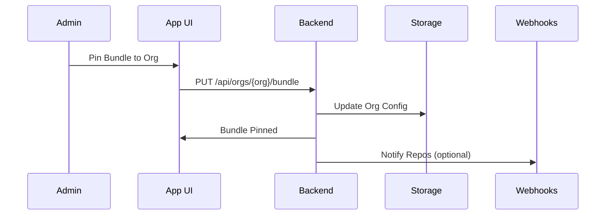
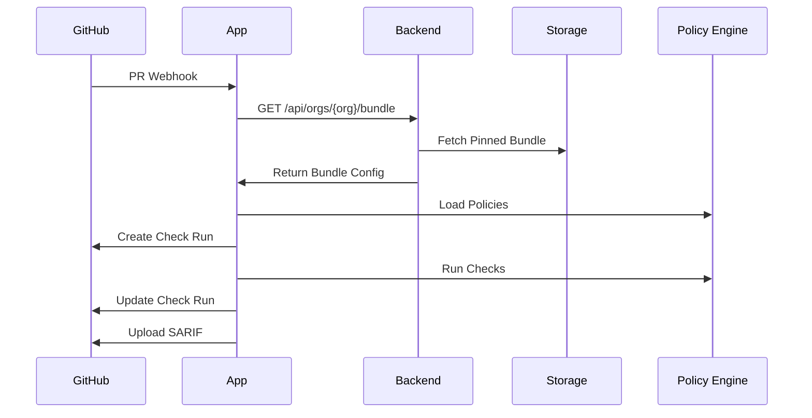

# Policy Bundle Distribution Model

## Overview

Policy bundles are versioned, org-pinned configurations that define which ISL policy packs are enforced across an organization's repositories.

## Bundle Structure

### Bundle Manifest

```typescript
interface PolicyBundle {
  // Identity
  id: string;                    // Unique bundle ID
  version: string;              // Semantic version (e.g., "1.2.3")
  org: string;                  // GitHub org name
  
  // Metadata
  name: string;                 // Human-readable name
  description?: string;          // Bundle description
  createdAt: string;             // ISO 8601 timestamp
  pinnedAt: string;             // When pinned to org
  pinnedBy: string;             // GitHub username who pinned
  
  // Policy Configuration
  policies: {
    required: PolicyPackConfig[];  // Must be enabled
    optional: PolicyPackConfig[];  // Can be enabled per-repo
  };
  
  // Check Configuration
  checks: {
    required: string[];          // Required check names
    optional: string[];           // Optional check names
  };
  
  // Enforcement Rules
  enforcement: {
    failOnWarning: boolean;       // Fail checks on warnings
    blockingPolicies: string[];   // Policy IDs that block merge
    allowOverrides: boolean;      // Allow repo-level overrides
  };
  
  // Version Constraints
  constraints?: {
    minIslVersion?: string;       // Minimum ISL CLI version
    maxIslVersion?: string;       // Maximum ISL CLI version
  };
}
```

### Policy Pack Configuration

```typescript
interface PolicyPackConfig {
  id: string;                    // Pack ID (e.g., "pii", "auth")
  version: string;               // Pack version to use
  enabled: boolean;              // Whether pack is enabled
  failOnWarning?: boolean;        // Pack-specific fail-on-warning
  
  // Rule Overrides
  ruleOverrides?: {
    [ruleId: string]: {
      enabled?: boolean;          // Disable specific rule
      severity?: 'error' | 'warning' | 'info';
      config?: Record<string, unknown>;  // Rule-specific config
    };
  };
  
  // Pack-specific Config
  config?: Record<string, unknown>;
}
```

## Distribution Architecture

### Storage Layer

```
┌─────────────────────────────────────┐
│  Policy Bundle Registry             │
│  (GitHub App Backend)               │
├─────────────────────────────────────┤
│  • Bundle Storage (DB/Cache)        │
│  • Version History                  │
│  • Org Pinning                      │
│  • CDN Distribution                 │
└─────────────────────────────────────┘
         │
         │ HTTP/HTTPS
         ▼
┌─────────────────────────────────────┐
│  GitHub App Instances               │
│  (Webhook Handlers)                 │
└─────────────────────────────────────┘
```

### Bundle Sources

1. **Built-in Bundles**
   - Pre-configured bundles shipped with App
   - Examples: `default`, `strict`, `permissive`
   - Versioned with App releases

2. **Custom Bundles**
   - Orgs can create custom bundles
   - Stored in App backend
   - Versioned independently

3. **Public Registry** (Future)
   - Community-shared bundles
   - Published to public registry
   - Versioned and signed

## Pinning Model

### Organization-Level Pinning

When an org pins a bundle:

1. **Selection**
   - Admin selects bundle version
   - Can choose built-in or custom bundle
   - Preview changes before pinning

2. **Pinning**
   - Bundle ID + version stored in org config
   - `pinnedAt` timestamp recorded
   - `pinnedBy` user recorded

3. **Propagation**
   - All repos in org inherit bundle
   - New repos automatically get bundle
   - Existing repos get bundle on next PR

4. **Version Locking**
   - Repos use exact pinned version
   - No automatic upgrades
   - Admins must explicitly update

### Repository Overrides

Repos can override org defaults:

```typescript
interface RepoOverride {
  repo: string;                  // Full repo name (owner/repo)
  bundle?: {
    useOrgDefault: boolean;      // Use org bundle (default: true)
    customBundle?: string;        // Custom bundle ID
  };
  policies?: {
    disable?: string[];           // Disable specific policies
    enable?: string[];           // Enable optional policies
    overrides?: {
      [policyId: string]: PolicyPackConfig;
    };
  };
  checks?: {
    disable?: string[];           // Disable specific checks
    enable?: string[];            // Enable optional checks
  };
  requiresApproval: boolean;     // Override requires admin approval
}
```

## Version Management

### Semantic Versioning

Bundles use semantic versioning:

- **MAJOR**: Breaking changes (policy removals, API changes)
- **MINOR**: New policies added, non-breaking changes
- **PATCH**: Bug fixes, rule updates

### Version Resolution

1. **Exact Match** (Preferred)
   ```
   Bundle: acme-strict@1.2.3
   Resolves to: 1.2.3 exactly
   ```

2. **Version Range** (Future)
   ```
   Bundle: acme-strict@^1.2.0
   Resolves to: Latest 1.x.x (>=1.2.0, <2.0.0)
   ```

3. **Latest** (Not Recommended)
   ```
   Bundle: acme-strict@latest
   Resolves to: Latest version (risky)
   ```

### Update Strategy

**Manual Updates** (Recommended)
- Admins explicitly update pinned version
- Review changelog before updating
- Test in staging repo first

**Automatic Updates** (Optional)
- Auto-update patch versions only
- Require approval for minor/major
- Notify admins of updates

## Bundle Distribution Flow

### 1. Bundle Creation



### 2. Org Pinning



### 3. Check Execution



## Caching Strategy

### Multi-Level Cache

1. **In-Memory Cache** (App Instance)
   - Cache per-instance
   - TTL: 5 minutes
   - Key: `bundle:{org}:{version}`

2. **Redis Cache** (Shared)
   - Shared across instances
   - TTL: 15 minutes
   - Key: `bundle:{org}:{version}`

3. **CDN Cache** (Public)
   - For public bundles
   - TTL: 1 hour
   - Key: `bundles/{bundleId}/{version}.json`

### Cache Invalidation

- **On Pin**: Invalidate org cache
- **On Update**: Invalidate bundle cache
- **On Override**: Invalidate repo cache

## Security Considerations

### Bundle Integrity

1. **Signing** (Future)
   - Sign bundles with GPG/Ed25519
   - Verify signatures on fetch
   - Prevent tampering

2. **Access Control**
   - Only org admins can pin bundles
   - Audit log all pinning actions
   - Require 2FA for bundle updates

3. **Validation**
   - Validate bundle schema
   - Check policy pack versions exist
   - Verify rule IDs are valid

### Rate Limiting

- Limit bundle fetches per org
- Throttle API requests
- Cache aggressively

## API Design

### Bundle API

```typescript
// Get org's pinned bundle
GET /api/orgs/{org}/bundle
Response: PolicyBundle

// Pin bundle to org
PUT /api/orgs/{org}/bundle
Body: { bundleId: string, version: string }
Response: PolicyBundle

// List available bundles
GET /api/bundles
Query: ?org={org}&type={builtin|custom}
Response: BundleSummary[]

// Get bundle details
GET /api/bundles/{bundleId}/versions/{version}
Response: PolicyBundle

// Create custom bundle
POST /api/bundles
Body: PolicyBundle (without id/version)
Response: PolicyBundle

// Update bundle
PATCH /api/bundles/{bundleId}/versions/{version}
Body: Partial<PolicyBundle>
Response: PolicyBundle
```

### Repository Override API

```typescript
// Get repo override
GET /api/repos/{owner}/{repo}/override
Response: RepoOverride | null

// Set repo override
PUT /api/repos/{owner}/{repo}/override
Body: RepoOverride
Response: RepoOverride

// Delete repo override
DELETE /api/repos/{owner}/{repo}/override
Response: void
```

## Migration Path

### From GitHub Action to App

1. **Phase 1: Parallel Run**
   - App runs alongside Action
   - Compare results
   - Validate App behavior

2. **Phase 2: Gradual Migration**
   - Pin bundle matching Action config
   - Enable App checks as non-blocking
   - Monitor for issues

3. **Phase 3: Full Migration**
   - Make App checks required
   - Remove Action workflows
   - App becomes single source of truth

## Monitoring & Observability

### Metrics

- Bundle fetch latency
- Cache hit rate
- Bundle pinning frequency
- Override usage
- Version distribution

### Logging

- All bundle fetches
- All pinning actions
- All override changes
- Cache misses
- API errors

### Alerts

- Bundle fetch failures
- Cache miss spikes
- Version conflicts
- Override abuse
